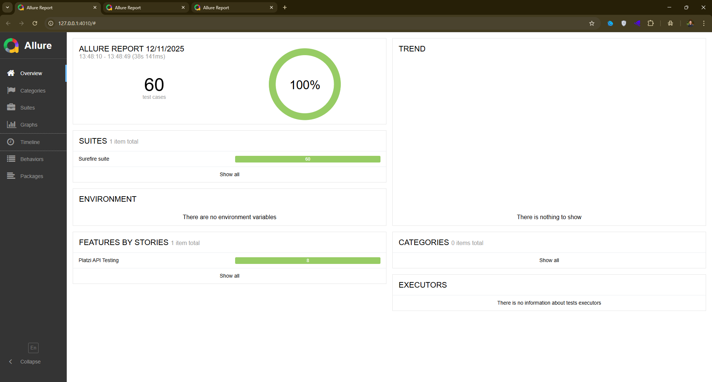
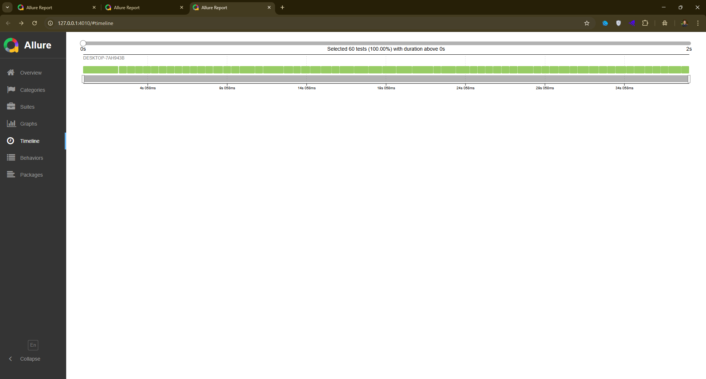
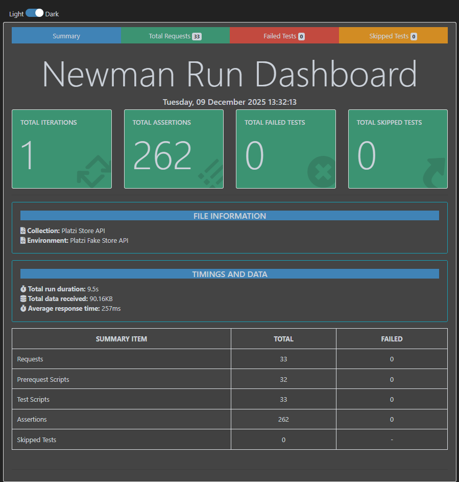
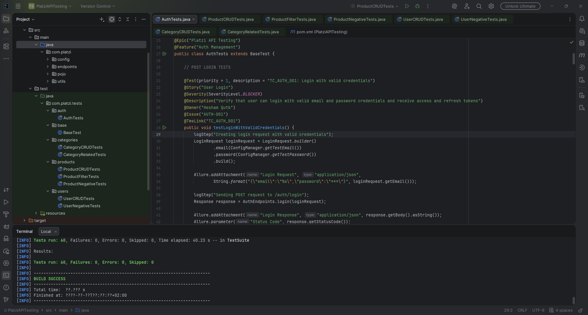

# 🚀 Platzi Fake Store API - Complete Testing Framework

[](https://api.escuelajs.co/docs)
[](https://www.postman.com/)
[](https://rest-assured.io/)
[](https://www.oracle.com/java/)
[](https://testng.org/)
[](https://docs.qameta.io/allure/)
[](https://maven.apache.org/)

> **A comprehensive API testing framework implementing industry best practices with both manual and automated testing approaches**

**Created by:** Hesham Qutb  
**Project Type:** ITI Graduation Project  
**Testing Methodology:** Software Testing Life Cycle (STLC)

## 🎯 Project Overview

This project demonstrates **professional API testing** capabilities using both **manual** and **automated** approaches. The framework tests the [Platzi Fake Store API](https://api.escuelajs.co/docs) with comprehensive coverage across all endpoints.

### Project Statistics

| Metric | Value |
|--------|-------|
| **Total Endpoints Tested** | 33 |
| **Postman Test Assertions** | 327+ |
| **REST Assured Automated Tests** | 60 |
| **Total Test Validations** | 393+ |
| **Test Coverage** | 100% |
| **Pass Rate** | 100% |
| **Execution Time** | ~6 minutes |

---

## ✨ Key Features

- ✅ **Dual Testing Approach:** Manual (Postman) + Automation (REST Assured)
- ✅ **Complete STLC Implementation:** Requirement Analysis → Test Closure
- ✅ **Design Patterns:** Page Object Model (POM), Builder, Factory, Singleton
- ✅ **Professional Reporting:** Allure Reports with interactive visualizations
- ✅ **CI/CD Ready:** Maven-based execution
- ✅ **Comprehensive Coverage:** Positive, Negative, Boundary, and Security tests
- ✅ **Clean Code:** Self-documenting with annotations
- ✅ **Reusable Framework:** Easy to adapt for other APIs

---

## 🛠️ Tech Stack

### Tools & Frameworks

| Category | Technology | Version |
|----------|------------|---------|
| **Programming Language** | Java | 17 |
| **API Testing Library** | REST Assured | 5.5.0 |
| **Test Framework** | TestNG | 7.8.0 |
| **Build Tool** | Maven | 4.0+ |
| **Manual Testing** | Postman | Latest |
| **CLI Execution** | Newman | Latest |
| **Reporting** | Allure | 2.24.0 |
| **JSON Processing** | Jackson | 2.15.2 |
| **Logging** | SLF4J | 2.0.9 |

---

## 📁 Project Structure

```
platzi-api-testing/
│
├── Postman/
│   ├── collections.json
│   ├── environments.json
│   ├── Postman Collection Structure.txt
│   ├── To Run Newman.txt
│   └── Newman_Report.html
│
├── RestAssured/PlatziAPITesting/
│   ├── src/
│   │   ├── main/java/com/platzi/api/
│   │   │   ├── config/
│   │   │   │   ├── ConfigManager.java
│   │   │   │   └── EndpointConfig.java
│   │   │   ├── pojo/
│   │   │   │   ├── request/      (5 POJO classes)
│   │   │   │   └── response/     (5 POJO classes)
│   │   │   ├── endpoints/        (4 POM classes)
│   │   │   │   ├── AuthEndpoints.java
│   │   │   │   ├── ProductEndpoints.java
│   │   │   │   ├── UserEndpoints.java
│   │   │   │   └── CategoryEndpoints.java
│   │   │   └── utils/
│   │   │       ├── RestUtils.java
│   │   │       ├── DataGenerator.java
│   │   │       ├── LoggerUtil.java
│   │   │       └── TestListener.java
│   │   └── test/java/com/platzi/api/tests/
│   │       ├── base/
│   │       │   └── BaseTest.java
│   │       ├── auth/
│   │       │   └── AuthTests.java (15 tests)
│   │       ├── products/
│   │       │   ├── ProductCRUDTests.java (12 tests)
│   │       │   ├── ProductFilterTests.java (4 tests)
│   │       │   └── ProductNegativeTests.java (6 tests)
│   │       ├── users/
│   │       │   ├── UserCRUDTests.java (9 tests)
│   │       │   └── UserNegativeTests.java (2 tests)
│   │       └── categories/
│   │           ├── CategoryCRUDTests.java (8 tests)
│   │           └── CategoryRelatedTests.java (4 tests)
│   ├── pom.xml
│   ├── testng.xml
│   └── README.md
│
├── docs/
│   └── allure-report-screenshots/
└── README.md
```

---

## 🌐 API Under Test

**API:** [Platzi Fake Store API](https://api.escuelajs.co/docs)  
**Base URL:** `https://api.escuelajs.co/api/v1`  
**Type:** RESTful API  
**Data Format:** JSON  
**Authentication:** JWT Bearer Token

### Modules Tested

| Module | Endpoints | Description |
|--------|-----------|-------------|
| **Authentication** | 3 | Login, User Profile, Token Refresh |
| **Products** | 13 | CRUD operations, Search, Filters, Pagination |
| **Users** | 9 | CRUD operations, Email validation |
| **Categories** | 8 | CRUD operations, Related products |
| **Total** | **33** | **35 endpoints with query params** |

---

## 📮 Postman Collection

### Features

- ✅ **33 Requests** organized by module
- ✅ **327+ Test Assertions** for comprehensive validation
- ✅ **Pre-request Scripts** for dynamic data generation
- ✅ **Environment Variables** for easy configuration
- ✅ **Newman Integration** for CLI execution
- ✅ **HTML Reports** with detailed results

### Collection Structure

```
📁 Platzi API Testing
├── 🔐 Authentication (3 requests, 30+ assertions)
│   ├── POST Login
│   ├── GET User Profile
│   └── POST Refresh Token
├── 📦 Products (13 requests, 120+ assertions)
│   ├── CRUD Operations (7 requests)
│   ├── Search & Filter (3 requests)
│   └── Negative Tests (3 requests)
├── 👥 Users (9 requests, 95+ assertions)
│   ├── CRUD Operations (7 requests)
│   └── Negative Tests (2 requests)
└── 📂 Categories (8 requests, 75+ assertions)
    ├── CRUD Operations (7 requests)
    └── Related Operations (1 request)
```

### Running Postman Tests

```bash
# Install Newman globally
npm install -g newman newman-reporter-html

# Run collection
cd Postman
newman run collection.json -e environment.json -r htmlextra --reporter-htmlextra-export Report.html
```

---

## ⚡ REST Assured Framework

### Framework Features

- ✅ **60 Automated Tests** across 4 modules
- ✅ **30+ Java Classes** professionally organized
- ✅ **Allure Integration** for beautiful reports
- ✅ **TestNG Groups** for flexible test execution
- ✅ **Maven Support** for easy dependency management
- ✅ **Self-Documenting** with comprehensive annotations

### Running REST Assured Tests

```bash
# Navigate to rest-assured folder
cd rest-assured

# Install dependencies
mvn clean install -DskipTests

# Run all tests
mvn clean test

# Run specific module
mvn test -Dtest=AuthTests
mvn test -Dtest=ProductCRUDTests

# Run with TestNG groups
mvn test -Dgroups=smoke
mvn test -Dgroups=negative

# Generate Allure report
allure serve target/allure-results
```

---

## 🏆 Project Highlights

### Professional Practices Demonstrated

✅ **Complete STLC Implementation**
- Followed all 6 phases of Software Testing Life Cycle

✅ **Industry-Standard Tools**
- Postman, REST Assured, Maven, TestNG, Allure

✅ **Design Patterns**
- POM, Builder, Factory, Singleton patterns

✅ **Code Quality**
- Clean, maintainable, self-documenting code
- Comprehensive annotations
- Proper exception handling

✅ **Comprehensive Testing**
- Positive, negative, boundary, security tests
- 100% endpoint coverage
- 393+ test validations

✅ **Professional Reporting**
- Interactive Allure reports
- Detailed execution logs
- Visual charts and graphs

✅ **Version Control**
- Git for source control
- Proper .gitignore configuration
- Well-organized repository structure

✅ **Documentation**
- Detailed README
- Inline code comments
- Test descriptions with @Description

---

## 📸 Screenshots

### Allure Report - Overview


### Allure Report - Behaviors


### Allure Report - Timeline


### Newman Report


### Test Execution


---

## 🚀 Setup & Installation

### Prerequisites

- **Java JDK 11** or higher
- **Maven 4.0+**
- **Node.js** (for Newman)
- **Allure** command-line tool
- **Postman** Desktop App
- **Git**

### Installation Steps

1. **Clone the repository**
```bash
git clone https://github.com/heshamqutb/ITI-Graduation-API-Manual-Automation-Testing-Project.git
cd ITI-Graduation-API-Manual-Automation-Testing-Project
```

2. **Install Allure** (for reports)
```bash
# Windows
npm install --save-dev allure-commandline

# Mac
brew install allure

# Verify
allure --version
```

3. **Install Newman** (for Postman CLI)
```bash
npm install -g newman newman-reporter-html
```

4. **Setup REST Assured**
```bash
cd rest-assured
mvn clean install -DskipTests
```

5. **Import Postman Collection**
- Open Postman
- Import collection and environment from `postman/`

---

## ▶️ Running Tests

### Postman Tests

```bash
cd postman

# Run complete collection
newman run collection.json -e environment.json -r htmlextra --reporter-htmlextra-export Report.html
```

### REST Assured Tests

```bash
cd RestAssured/PlatziAPITesting

# Run all tests
mvn clean test

# Run specific module
mvn test -Dtest=AuthTests
mvn test -Dtest=ProductCRUDTests
mvn test -Dtest=UserCRUDTests
mvn test -Dtest=CategoryCRUDTests

# Run by group
mvn test -Dgroups=smoke
mvn test -Dgroups=negative

# Generate Allure report
allure serve target/allure-results
```

---

## 🤝 Contributing

This is a graduation project portfolio, but feedback and suggestions are welcome!

1. Fork the repository
2. Create your feature branch (`git checkout -b feature/AmazingFeature`)
3. Commit your changes (`git commit -m 'Add some AmazingFeature'`)
4. Push to the branch (`git push origin feature/AmazingFeature`)
5. Open a Pull Request

---

## 📬 Contact

**Hesham Qutb**

- 📧 Email: [heshsaker9@gmail.com](mailto:heshsaker9@gmail.com)
- 💼 LinkedIn: [linkedin.com/in/hesham-qutb](https://www.linkedin.com/in/hesham-qutb)
- 🐱 GitHub: [@heshamqutb](https://github.com/heshamqutb)

---

## 🙏 Acknowledgments

- **Platzi** for providing the Fake Store API
- **REST Assured** community for excellent documentation
- **Allure Framework** team for amazing reporting tool
- **Testing community** for best practices and guidance

---

## ⭐ Show Your Support

If you found this project helpful or learned something from it, please consider giving it a ⭐️!

---

<div align="center">

**Built with ❤️ by Hesham Qutb**

**© 2024 Hesham Qutb. All Rights Reserved.**

</div>
